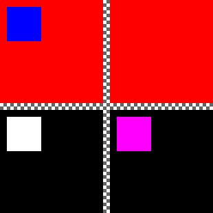

## qt-test-utils
Extensions to Qt testing framework

### Features:
- running all QtTest tests cases in one executable (usefull e.g. in case of one tests subproject in QtCreator)
- calling QtTest and QtQuickTest tests by name using wildcard(*)
- loading/saving images from/to file directly from Qml
- comparing images and visualising difference between them

### Example of generated diff image

Example presents difference of two images. Result consists of four *subimages*:
- on upper left corner: test image
- upper right corner: reference image
- lower right corner: difference between two images
- lower left corner: mask of differences

### Use:
Import *testutils* subproject to projects tree (subdirs template).

For every source file with QtTest tests:
1. write standard Qt test case file
2. include *QTestRegister.h*

Only once:
- for QtTest: create "main" source file and call *QTEST_RUN_TESTS()* macro from *QtTestRegister.h*
- for QtQuickTest: create "main" source and call *quicktestutils::run_tests()* runner from *QuickTestRegister.h*

### Examples:
- *testutils-qttests* - example subproject containing QtTest tests
- *testutils-quicktests* - example subproject containing QtQuickTest tests

### Macros:
- *QTEST_REGISTER()* -- register test case for tests runner
- *QTEST_MAIN()* -- redefined standard macro to call *QTEST_REGISTER()*
- *QTEST_RUN_TESTS()* - tests runner -- generates *main()* function (to be used only once)

### Other things:
- *common.pri* contains example of function definition for qmake -- *linkStaticLibrary()* -- function demonstrates how to link static libraries
- qmake function *generateResFile* from *common.pri* demonstrates how to dynamically generate resource file
